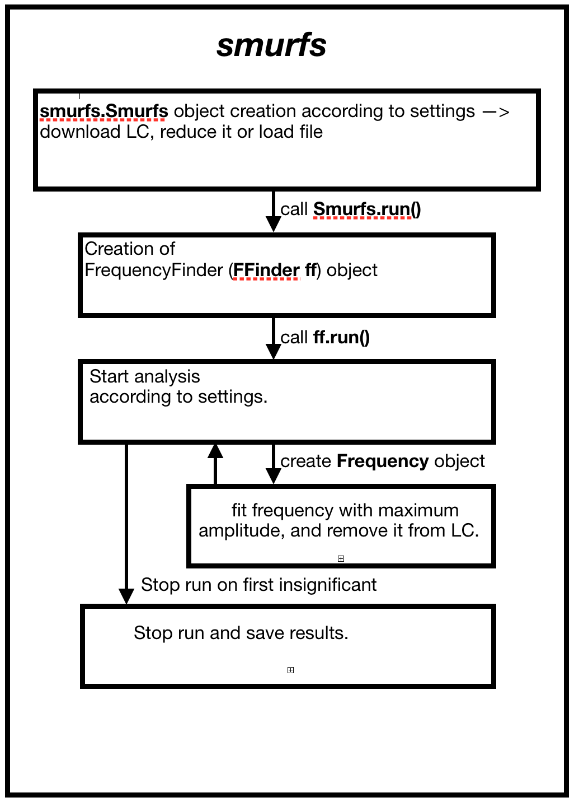

Internals
=========

To understand the internals of SMURF, lets first consider this rough schematic on the run taken in the
:ref:`quickstart page <Quickstart>`.

Very generally, what SMURFS does is the following procedure:

1) Create a :meth:`smurfs.Smurfs` object according to the settings provided through the constructor or through the command line

2) Call :meth:`smurfs.Smurfs.run`. This in turn creates a  :meth:`smurfs.FFinder` object, stored in the :meth:`smurfs.Smurfs.ff` property.

3) :meth:`smurfs.Smurfs.run` calls :meth:`smurfs.FFinder.run`, which iteratively tries to find all significant frequencies in the data.

4) This iterative run creates a :meth:`smurfs.Frequency` object for each frequency it finds.

5) After it finds the first insignificant frequency (insignificant defined through the set SNR and window size) or after n insignificant (if the extend_frequencies parameter is set) it stops the run and saves the data

There are a lot of different settings you can set that slightly change this behaviour one way or the other, but in
principle it stays this way. While the individual pages on the classes give you a lot more insight on the each of them,
we want to give an overview here over the individual classes.

:meth:`smurfs.Smurfs`
---------------------

This is the base class, which is the prime interface to all things SMURFS. If you want to incorporate SMURFS into
your own code, you want to follow this procedure (this is what SMURFS does internally also when using it as
a standalone tool):

1) Instantiate :meth:`smurfs.Smurfs` through the constructor and pass the appropiate parameters.
Use the `file` parameter if you want to provide a file, use the `time` and `flux` parameter if you want to provide
these things directly as arrays or use the `target_name` parameter if you want to provide the name of the target.

2) Call :meth:`smurfs.Smurfs.run` to start the analysis. Provide the parameters according to its documentation.

3) Call :meth:`smurfs.Smurfs.save` to save the data to the path of your choosing.

This will store the result as described in :ref:`quickstart page <Quickstart>`. After you completed step 2, you will
also have direct access to the :meth:`smurfs.Smurfs.result` property. This property, at its heart, is a simple
`pandas <https://pandas.pydata.org/>`_ object. It contains all the individual :meth:`smurfs.Frequency` objects and
you can access each individual one through iloc. Assuming your SMURFS object is called `star`, you can access it like
this:

.. code-block:: python

    In [1]: star.result
    Out[1]:
                                                      f_obj            frequency                amp            phase        snr  res_noise  significant
    f_nr
    0     <smurfs._smurfs.frequency_finder.Frequency obj...  1.363741+/-0.000004  0.01033+/-0.00008  0.3267+/-0.0012  14.621918  -0.000890         True
    1     <smurfs._smurfs.frequency_finder.Frequency obj...  1.321203+/-0.000004  0.01025+/-0.00008  1.2294+/-0.0012  17.646618  -0.000841         True
    2     <smurfs._smurfs.frequency_finder.Frequency obj...  1.470777+/-0.000015  0.00281+/-0.00008    0.965+/-0.004   7.578344  -0.000855         True
    3     <smurfs._smurfs.frequency_finder.Frequency obj...  1.878144+/-0.000017  0.00241+/-0.00008    0.517+/-0.005   6.717144  -0.000854         True
    4     <smurfs._smurfs.frequency_finder.Frequency obj...  1.385307+/-0.000018  0.00223+/-0.00008    0.175+/-0.005   7.318523  -0.000865         True
    5     <smurfs._smurfs.frequency_finder.Frequency obj...  0.316642+/-0.000020  0.00203+/-0.00008    0.254+/-0.006   5.597835  -0.000865         True
    6     <smurfs._smurfs.frequency_finder.Frequency obj...  1.417226+/-0.000023  0.00181+/-0.00008    0.384+/-0.007   6.523381  -0.000859         True
    7     <smurfs._smurfs.frequency_finder.Frequency obj...  2.742524+/-0.000023  0.00178+/-0.00008    0.943+/-0.007   9.558567  -0.000859         True
    8     <smurfs._smurfs.frequency_finder.Frequency obj...  0.112357+/-0.000025  0.00163+/-0.00008    0.023+/-0.007   5.270446  -0.000856         True
    9     <smurfs._smurfs.frequency_finder.Frequency obj...  1.237200+/-0.000029  0.00139+/-0.00008    0.091+/-0.009   5.176608  -0.000856         True
    10    <smurfs._smurfs.frequency_finder.Frequency obj...    1.68152+/-0.00004  0.00112+/-0.00008    0.166+/-0.011   4.585938  -0.000860         True

You can access each indivdual frequency through pandas `iloc` method, and the individual values through their names.
For example, you can access the frequency object like this:

.. code-block:: python

    In [2]: star.result.iloc[0]
    Out[2]:
    f_obj          <smurfs._smurfs.frequency_finder.Frequency obj...
    frequency                                    1.363741+/-0.000004
    amp                                            0.01033+/-0.00008
    phase                                            0.3267+/-0.0012
    snr                                                      14.6219
    res_noise                                           -0.000889747
    significant                                                 True
    Name: 0, dtype: object

    In [3]: star.result.iloc[0].f_obj
    Out[3]: <smurfs._smurfs.frequency_finder.Frequency at 0x12c0536a0>

This way you can access the full interface of the :meth:`smurfs.Frequency` class.

You can also access the linked :meth:`smurfs.FFinder` object through the :meth:`smurfs.Smurfs.ff` property:

.. code-block:: python

    In [4]: star.ff
    Out[4]: <smurfs._smurfs.frequency_finder.FFinder at 0x12c074e48>

The :meth:`smurfs.Smurfs` object also gives you some statistics about each run. You can access those through the
:meth:`smurfs.Smurfs.statistics` property:

.. code-block:: python

    In [5]: star.statistics
    Out[5]:
       Duty cycle  Nyquist frequency  Total number of found frequencies
    0    0.844463         360.001476                                 11

Reading results works through the :meth:`smurfs.Smurfs.load_results` method:

.. code-block:: python

    In [6]: Smurfs.load_results("Gamma_Doradus/data/result.csv")
    Out[6]:
    (   Unnamed: 0  Signal to Noise Ratio  Window size  ...  Skip similar frequency regions  Chancel run after 10 similar frequencies  Ignore unsignificant frequencies number
     0           0                    4.0          2.0  ...                           False                                      True                                        0

     [1 rows x 8 columns],
        Unnamed: 0  Duty cycle  Nyquist frequency  Total number of found frequencies
     0           0    0.844463         360.001476                                 11,
         f_nr            frequency                amp            phase        snr  res_noise  significant
     0      0  1.363741+/-0.000004  0.01033+/-0.00008  0.3267+/-0.0012  14.621918  -0.000890         True
     1      1  1.321203+/-0.000004  0.01025+/-0.00008  1.2294+/-0.0012  17.646618  -0.000841         True
     2      2  1.470777+/-0.000015  0.00281+/-0.00008    0.965+/-0.004   7.578344  -0.000855         True
     3      3  1.878144+/-0.000017  0.00241+/-0.00008    0.517+/-0.005   6.717144  -0.000854         True
     4      4  1.385307+/-0.000018  0.00223+/-0.00008    0.175+/-0.005   7.318523  -0.000865         True
     5      5  0.316642+/-0.000020  0.00203+/-0.00008    0.254+/-0.006   5.597835  -0.000865         True
     6      6  1.417226+/-0.000023  0.00181+/-0.00008    0.384+/-0.007   6.523381  -0.000859         True
     7      7  2.742524+/-0.000023  0.00178+/-0.00008    0.943+/-0.007   9.558567  -0.000859         True
     8      8  0.112357+/-0.000025  0.00163+/-0.00008    0.023+/-0.007   5.270446  -0.000856         True
     9      9  1.237200+/-0.000029  0.00139+/-0.00008    0.091+/-0.009   5.176608  -0.000856         True
     10    10    1.68152+/-0.00004  0.00112+/-0.00008    0.166+/-0.011   4.585938  -0.000860         True)

This returns two pandas DataFrames, the first containing the statistics, the second containing the actual results. These
of course don't include the :meth:`smurfs.Frequency` objects, as this is only a text file. You can however load a full
smurfs object (if you saved it through setting `store_obj=True` or by setting the `-so` flag when using the standalone
version.

.. code-block:: python

    In [7]: star = Smurfs.from_path("Gamma_Doradus")

    In [8]: star
    Out[8]: <smurfs._smurfs.smurfs.Smurfs at 0x13562aa20>

    In [9]: star.result
    Out[9]:
                                                      f_obj            frequency                amp            phase        snr  res_noise  significant
    f_nr
    0     <smurfs._smurfs.frequency_finder.Frequency obj...  1.363741+/-0.000004  0.01033+/-0.00008  0.3267+/-0.0012  14.621918  -0.000890         True
    1     <smurfs._smurfs.frequency_finder.Frequency obj...  1.321203+/-0.000004  0.01025+/-0.00008  1.2294+/-0.0012  17.646618  -0.000841         True
    2     <smurfs._smurfs.frequency_finder.Frequency obj...  1.470777+/-0.000015  0.00281+/-0.00008    0.965+/-0.004   7.578344  -0.000855         True
    3     <smurfs._smurfs.frequency_finder.Frequency obj...  1.878144+/-0.000017  0.00241+/-0.00008    0.517+/-0.005   6.717144  -0.000854         True
    4     <smurfs._smurfs.frequency_finder.Frequency obj...  1.385307+/-0.000018  0.00223+/-0.00008    0.175+/-0.005   7.318523  -0.000865         True
    5     <smurfs._smurfs.frequency_finder.Frequency obj...  0.316642+/-0.000020  0.00203+/-0.00008    0.254+/-0.006   5.597835  -0.000865         True
    6     <smurfs._smurfs.frequency_finder.Frequency obj...  1.417226+/-0.000023  0.00181+/-0.00008    0.384+/-0.007   6.523381  -0.000859         True
    7     <smurfs._smurfs.frequency_finder.Frequency obj...  2.742524+/-0.000023  0.00178+/-0.00008    0.943+/-0.007   9.558567  -0.000859         True
    8     <smurfs._smurfs.frequency_finder.Frequency obj...  0.112357+/-0.000025  0.00163+/-0.00008    0.023+/-0.007   5.270446  -0.000856         True
    9     <smurfs._smurfs.frequency_finder.Frequency obj...  1.237200+/-0.000029  0.00139+/-0.00008    0.091+/-0.009   5.176608  -0.000856         True
    10    <smurfs._smurfs.frequency_finder.Frequency obj...    1.68152+/-0.00004  0.00112+/-0.00008    0.166+/-0.011   4.585938  -0.000860         True

Be aware that these objects take up a lot of disk space, especially for targets with many significant frequencies.

:meth:`smurfs.FFinder`
----------------------

The FFinder object contains the actual logic for the frequency analysis. As describe above, it iteratively runs
through the significant frequencies. The method that is used here is the :meth:`smurfs.FFinder.run` and performs
the analysis according to its settings. This is mostly an internal class and not much use outside of SMURFS. You
can check the individual methods through its documentation.

:meth:`smurfs.Frequency`
------------------------

This class represents each individual frequency. It contains all settings and results for each frequency. The process on
how the result is found is the following:

1) The object is built through the constructor by passing the light curve, snr and window size. It computes the corresponding :meth:`smurfs.Periodogram` object

2) Using the frequency with the maximum amplitude in the periodogram, it then computes the boundaries of the peak, by finding the corresponding next two minima to the left and right of the peak

3) You can then

The most
important ones are:

- :meth:`smurfs.Frequency.lc`: Gives you the `LightCurve <https://docs.lightkurve.org/api/lightkurve.lightcurve.LightCurve.html#lightkurve.lightcurve.LightCurve>`_ object that the frequency uses for the analysis.
- :meth:`smurfs.Frequency.amp`: Returns the amplitude of the frequency.
- :meth:`smurfs.Frequency.f`: Returns the frequency.
- :meth:`smurfs.Frequency.phase`: Returns the phase of the frequency.
- :meth:`smurfs.Frequency.snr`: Returns the SNR of the frequency.