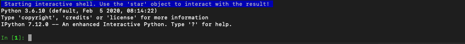
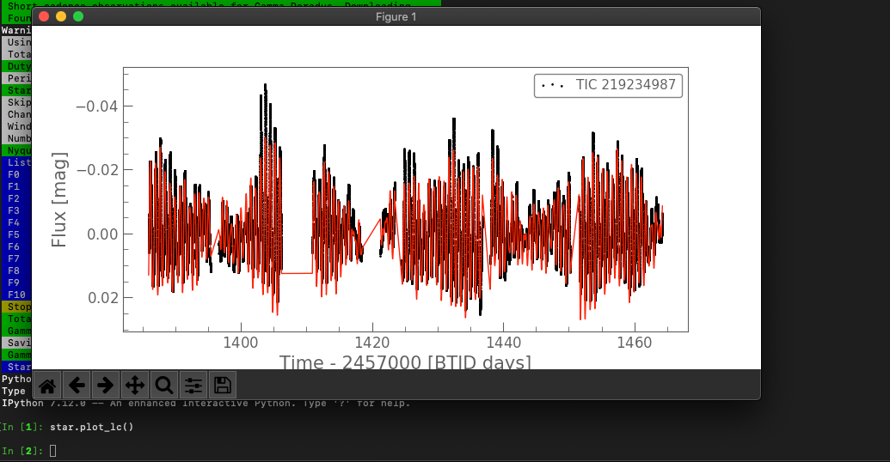

Interactive Mode
================

One of the core features of SMURFS is the ability to actually interact with the result of a SMURFS run. It therefore
has something called an **interactive mode**. To activate it, you have the positional argument **--interactive**,
or **-i**.

.. code-block:: bash

   smurfs "Gamma Doradus" 4 2 -i

If a run is then completed, SMURFS will start an `IPython <https://ipython.org/>`_ shell. IPython has a couple of
advantages to a normal Python shell:

- Object introspection and a powerful autocompleter
- An input history and search
- *magic* commands, similar to jupyter

and much more. Check the IPython documentation, if you are interested in more details.

After the shell is started, you get prompted by the following message:

To interact with the SMURFS object, you can use the **star** object. Using this object you can do a myriad of things.
For example, you can open an interactive plot of the light curve, by calling

.. code-block:: python

    star.plot_lc()

resulting in the following output:

This is just a small glimpse on what you can do with interactive mode. The star object has the full capabilities
of the :ref:`smurfs.Smurfs <smurfs.Smurfs>` class. You can check the :ref:`internals page <Internals>` page, to
get an idea how SMURFS is built. After that, you can also check the advanced examples. These are written in Jupyter
notebooks, but all of the usages there are available in the interactive mode as well.