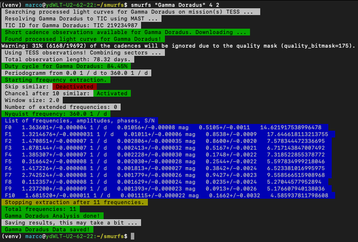

Quickstart
==========

Usually if we want to take a look at the time series of a given star, we want to take a look at its amplitude spectrum
and time series and extract the significant frequencies from it. Depending on the object, this can be a quite
involved process, starting with getting the data products, computing the amplitude spectrum and running it through
some manual tool that extracts frequencies for us. SMURFS makes this process really simple, and takes care of
all of those steps.

Lets say we want to take a look at the namesake of Delta Scuti pulsators, Gamma Doradus. Assuming you have
a virtual environment activated that contains a SMURF installation. To analyse Gamma Doradus, we can then simply call

.. code-block:: bash

   smurfs "Gamma Doradus" 4 2

The three parameter in this call are the absolute minimum you need to provide for SMURFS. Lets go through them:

- **First parameter**: The first parameter in a smurfs call represents the object, name or file containing the time
  series. For example, if you would have a file called light_curve.txt in your path, you can simply provide the file
  name as the parameter. However, if you provide a name, like in the example above, SMURFS will download/extract the
  light curve for you.
- **Second parameter**: The second parameter represents the lower bound of the Signal to Noise Ratio (SNR). SMURFS
  understands the SNR as the ratio between the amplitude of an individual frequency and its surrounding
  *background noise*. More on that below.
- **Third parameter**: Lastly, the third parameter represents the window size considered by SMURF when computing
  the SNR of any given frequency. Again, more on this parameter below.

So now that you have your analysis running, you should find the following output in your terminal:

SMURFS now generated a result path for this star. It takes the name given as the first parameter (or the filename
without the file ending) and creates a folder containing all necessary results. This is its file structure:

.. code-block:: bash

  - Gamma_Doradus
  - data
    - combinations.csv
    - result.csv
    - LC_residual.txt
    - LC.txt
    - PS_residual.txt
    - PS.txt
  - plots
    - LC_residual.pdf
    - LC.pdf
    - PS_residual.pdf
    - PS_result.pdf
    - PS.pdf

Additionally, it creates a Validation page if you extracted a target from TESS FFIs (also more on that later). now,
what is in these files?

- **data - plots folders**: The names of theses folders should be self explanatory. *data* contains text files with
  the results, and plots some relevant plots about the analysis.
- **combinations.csv**: For every run SMURFS performs, it automatically computes possible combination frequencies,
  that might not be real signal in the time series. This file contains these combinations. You can simply load it
  in python using *pandas.read_csv* if you want to do something with it further
- **result.csv**: The results file contains a myriad of information about the SMURFS run. It first gives you the
  settings with which SMURFS ran. Next, it shows you some statistics, like Duty cycle, Nyquist frequency and ottal
  number of found frequencies. Lastly, it lists all significant frequencies found by SMURFS. Due to the fact that
  this file is actually a combination of three csv files, it isn't very straight forward to load this file again.
  SMURFS provides a function for that though. If you call _Smurfs.load_results(path)_, it will load this file and
  return three pandas objects. **Amplitudes are always given in magnitudes**
- **LC and PS files**: LC and PS files represent the computed periodogram and used light curve (after sigma clipping),
  with which SMURFS ran. The residual files show you the light curve and periodogram after all found frequencies
  have been removed from the initial data set.
- **pdf files**: Again, these are pretty much self explanatory. They show you plots of the result, the residual and
  the initial data set.

In its simplest form, this is it for SMURFS. You can now go on and do cool science with those results. If you are
interested in all possible parameters, when using SMURFS as a stand alone product, check the
:ref:`standalone settings page <Standalone settings>`. You can also take a look at the various examples, that
are provided with this documentation. Alternatively, if you want to embed SMURFS in your code, you should check the
API page, as well as the examples for such use cases. You can also take a look at the
:ref:`internals page <Internals>`, to give you an idea how SMURFS actually performs its task.

