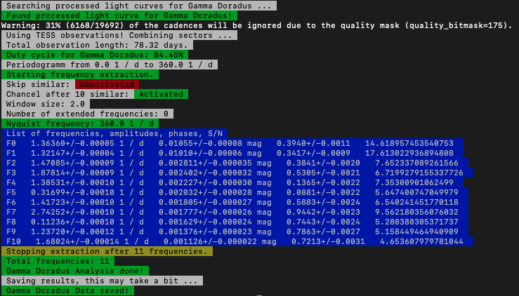

# Smurfs Documentation


**SMURFS** provides a fully automated way to extract frequencies from
timeseries data sets. It provides various interfaces, from a standalone command line tool, to jupyter and python 
integrations and computes possible frequency combinations, directly downloads and reduces (if necessary) data 
of TESS/Kepler/K2 observations and much much more.

## Getting started

To install smurfs, you need python > 3.5, pip as well as cmake. If you don't have these, install them through the
packet manager of your choice (f.e. _brew_(Mac) or _apt_ (Debian)). For pip check 
[here](https://pip.pypa.io/en/stable/installing/).

## Installation

First off, create a virtual environment

```bash
cd /Path/
python3 -m venv venv/
source venv/bin/activate
```

Install smurfs through pip

```bash
pip install smurfs
```

## Quickstart

Using SMURFS as a standalone command line tool is very simple. Simply call ```smurfs``` with a **target**, signal to noise
ratio cutoff and the window size. The target can be either:

- A path to a file, containing 2 columns with time and flux
- Any name of a star, that is resolvable by Simbad and has been observed by the **Kepler**,**K2** or **TESS** missions.

As an example, we can take a look at the star Gamma Doradus:
```
smurfs "Gamma Doradus" 4 2
```
Executing this command will make smurfs search for light curves of the star. It starts by using the 
[lightkurve.search.search_lightcurvefile](https://docs.lightkurve.org/api/lightkurve.search.search_lightcurvefile.html#lightkurve.search.search_lightcurvefile)
method, which queries MAST for processed light curves of the object. If this doesn't return any light curves, SMURFS 
will then check if the star has been observed by the TESS mission. It queries Simbad for the coordinates of the object 
and then checks if that point was observed by TESS. If so, we use [TessCut](https://mast.stsci.edu/tesscut/) and 
the [Eleanor](https://adina.feinste.in/eleanor/) pipeline to extract the light curve. 

In the case of Gamma Doradus, we have existing TESS SC light curves. Smurfs will give the following output:


SMURFS creates a result folder after running the code. In this case it has the following structure
```
- Gamma_Doradus
    - data
        - _combinations.csv
        - _result.csv
        - LC_residual.txt
        - LC.txt
        - PS_residual.txt
        - PS.txt         
    - plots
        - LC_residual.pdf
        - LC.pdf
        - PS_residual.pdf
        - PS_result.pdf
        - PS.pdf
```
The ```LC*.txt``` files contain the light curves, original and residual. The ```PS*.txt``` files contain the 
original as well as the residual amplitude spectrum. ```_combinations.csv``` shows all combination frequencies for the 
result and ```_result.csv``` gives the result for a given run.
 
## Documentation

```eval_rst
.. toctree::
   :maxdepth: 3
    
   example
   terminal
   api
```
